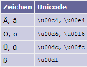

#JAVA GRUNDLAGEN
**1. Datentypen**

**2. Umgang mit Zeichenkette**

**3. Object Orientierte Programmierung**

**4. Ausnahme**

**5. Besondere Typen**

**6. Object vs Generic**

**7. Lambda Ausdücke**

**8. Design pattern**

**9. Klassen Bibliothek**

**10. Nebenläufigkeit**

**11. Graphische Oberfläche**

**12. Dateien und Datenströme**

**13. Unit Testing**

##1. Datentypen
|                    | 1 bit | 2 byte | 4byte  | 8byte  |
|--------------------|-------|--------|--------|--------|
| **Ganzzahlen**         |       | short  | int    | long   |
| **Fließkommazahlen**   |       |        | float  | double |
| **Weitere Datentypen** |boolean|        | char   |        |

##2. Umgang mit Zeichenkette

###Von ASCII zu Unicode

   * ASCII = American Standard Code for Information Interchange. 7-Bit Codieren von Zeichen der Amerikanische Alphabet um Dokumente auszutauschen
   * ISO/IEC 8859-1 = Erweiterung von ASCII um 1 Bit da Länder wie Latein Amerika und Ungarn andere Zeichen in ihren Alphabet besitzen
   * Unicode = Erweiterung der ISO damit Zeichen aller Länder der Welt berücksichtig sei. (UTF-32, UTF-16, UTF-8) Escape-Sequenzen


**Abbildung 1:** _Escape sequence_



**Abbildung 2:** _Unicode escape_

###Character Klasse
Bitte eine Sammlung von statische Methoden um Zeichen zu verarbeiten
   * static boolean isDigit(char ch) Handelt es sich um eine Ziffer zwischen 0 und 9?
   * static boolean isLetter(char ch) Handelt es sich um einen Buchstaben?
   * static boolean isLetterOrDigit(char ch)Handelt es sich um ein alphanumerisches Zeichen?
   * static boolean isLowerCase(char ch)& boolean isUpperCase(char ch)Ist es ein Klein- oder ein Großbuchstabe?
   * static boolean isWhiteSpace(char ch)
   * static char toUpperCase(char ch) &  static char toLowerCase(char ch)
   * static int digit(char ch, int radix)Liefert den numerischen Wert, den das Zeichen ch unter der Basis radix besitzt. Beispielsweise ist Character.digit('f', 16) gleich 15.
   * static char forDigit(int digit, int radix)

###Zeichenfolge
Sammlung von Zeichen = char[][] sind aber schwer zu behandeln daher bitte java String, StringBuffer und StringBuilder

|                       |Immutable(nicht änderbar)            |Mutable(änderbar)|
|-----------------------|-------------------------------------|-----------------------------------|
|**Threadsicher**       |String                               | StringBuffer                      |
|                       |String a = „papa“                    | String a = „papa“                 |
|                       |a += „mama“ =>                       | a.append(„mama“) => a = „papamama“|
|                       |new String a = a + new String(„mama“)|                                   |
|                       |old String a wurde nicht geändert    |                                   |
|                       |obwohl der neue den gleichen Name besitzt|                               |
|**Nicht Threadsicher** |-                                    | StringBuilder                     |

###Die Klasse String
Besitzt eine Sammlung von Statische Methoden.

   * Length(), isEmpty(), chartAt(), contains(), indexOf(), equals(), equalsIgnoreCase(); lastIndexOf(), startsWith(), endsWith(), matches(),regionMatches(start, str_to_check_match, startOfSTCM,endOfSTCM), subString(),substringBefore( "index.html", "." ) liefert "index", substringAfter( "index.html", "." ) liefert "html", toUpperCase(), toLowerCase(), concat(merge 2 String), join(trenzeichen, string1, str2 …)merge n String und fügt dabei ein trennzeichen
   * String replace(char oldChar, char newChar). Ersetzt einzelne Zeichen.
   * String replace(CharSequence target, CharSequence replacement). Ersetzt eine Zeichenkette durch eine andere Zeichenkette.
   * String replaceAll(String regex, String replacement). Ersetzt alle Strings, die durch einen regulären Ausdruck beschrieben werden.
   * String replaceFirst(String regex, String replacement). Ersetzt den ersten String, den ein regulärer Ausdruck beschreibt.

###Konvertieren zwischen Primitiven und Strings 
   * static String valueOf(boolean b)
   * static String valueOf(char c)
   * static String valueOf(double d)
   * static String valueOf(float f)
   * static String valueOf(int i)
   * static String valueOf(long l)
  
###String-Inhalt in einen primitiven Wert konvertieren
   * Boolean	parseBoolean( String s )	boolean
   * Byte	parseByte( String s )	byte
   * Short	parseShort( String s )	short
   * Integer	parseInt( String s )	int
   * Long	parseLong( String s )	long
   * Double	parseDouble( String s )	double
   * Float	parseFloat( String s )	float

###String-Repräsentation im Format Binär, Hex, Oktal
Von der Klasse Integer oder Long werden folgende methoden dafür gebraucht

   * static String toBinaryString(int i/long i)
   * static String toOctalString(int i/long i)
   * static String toHexString(inti /long i)
   
###Parsen von String mit Radix
Von der Klasse Integer oder Long werden folgende methoden dafür gebraucht

   * static int parseInt(String s)
   * static int parseInt(String s, int radix)

###Zerlegen von Zeichenketten
   * split(…) von String: Aufteilen mit einem Delimiter, den ein regulärer Ausdruck beschreibt
   * Scanner: schöne Klasse zum Ablaufen einer Eingabe
   * StringTokenizer: der Klassiker aus Java 1.0. Delimiter sind nur einzelne Zeichen.
   * BreakIterator: Findet Zeichen-, Wort-, Zeilen- oder Satz-Grenzen.
   * Matcher in Zusammenhang mit der Pattern-Klasse zerlegt mithilfe von regulären Ausdrücken.
  
###Ausgaben formatieren
System.out.printf(string, value) z.B. souf ( "|%d|%d|%n" , 123, -123 ); // |123|-123|

##3. Object Orientierte Programmierung

###Association
 Es gibt 1:1, 1:n, n:m und diese sind uni oder bidirectional zu betrachten
   * 1:1 => class Player { Room r} (uni-dir) ist bi-dir wenn Room class ein player instanz besitz
   * 1:n => class Player {List<Room> rooms}
   * n:m => class Player {List<Room> rooms}, class Room {List<Player> players}
   
###Vererbung
 Klasse Child erbt Parent
   * Child erbt alles von Parent bis auf private Funktionen und Attributen
   * Child aber send info an Parent via super() Methode (super = Parent Konstruktor Aufruf)
   * Wird der this in Child aufgerufen dann bezieht es sieht auf das Parent

###Typen Hierarchie
In der Instanziierung eines Objekts steht Links von der Instanz der statische Type(Parent) und Recht der Dynamische
z.B. wir haben Chid1 extends Parent und Child2 extends Parent. Dann können beide so instanziert werden
```java
public class Foo {
    public Foo(){
        Parent c1 = new Child1();
        Parent c2 = new Child2();
    }
}
 ```

##4. Ausnahme
Exception von Anwender abarbeiten lassen
```java 
throw new Exception(String message)
```  
Exception selbst abarbeiten
```java
public class Foo {
    public Foo(){
        try{ 
            System.out.println("Body hier");
         }catch(Exception e){ 
            e.message; 
        } 
    }
}
```
Eigene Exception (Custom Exception) _Komm in Einsatz wenn Ausgabe der angewandte Exception Klasse angepasst werden muss_

```java
public class UserNotFoundException extends Exception {
    public  UserNotFoundException(String message, String param1, String param2){
        super(message);
        // neue Ausgabe konstruieren
        System.out.format("%s %s %s",message, param1, param2);
    }
}
``` 

###HttpStatus Code für Webservices Exception Handling
Es gibt insgesamt 5 Error Code die von 1xx bis 5xx gehen.
   * 1xx stehen für information
   * 2xx stehen für Erfolgreiche Anfrage
   * 3xx stehen für Umleitung
   * 4xx stehen für client Fehler 
   * 5xx stehen für server Fehler

Meinste Fehler mit denen man in der Webwelt zu tun haben wird sind die 2xx,4xx,5xx. Nämlich
   * 200 => Anfrage erfolgreicht bearbeited 
   * 201 => Resource Erfolgreich angelegt
---
   * 400 => Bad Request (Server kann der URI nicht zuordnen)
   * 401 => Unauthorized (Server Check ob client eingegebene auth Daten mit Db oder LDAP stimmen)
   * 403 => Forbidden (Server check ob clien passende Rechte hat, wenn nicht dann 403)
   * 404 => Not Found (Das heißt z.b. client suche ein User welche der Server in der DB nicht findet. Dann return den Server ein 404)
---
   * 500 => Internal Server Fehler (Jemand hat ein Programmierfehler am Server gemacht z.B. Nullpointer...usw)
 


##5. Besondere Typen
###Object  
Mutter aller Klassen. Alle klasse die angelegt werden erben Default mäßig von der Klasse Object.
###Object/Klassen vergleichen 
Erfolg durch Implementierung der Klasse Comparator
###Wrapper-Klasse
Umwandlung von primitive Datentyp in Object. Ziel ist es z.B. int als Integer in Generic<T> zu benutzen
###Aufzählung / enum 
Erbt von der Klasse Enum. Es wird für jeden nächstkommende Antrag in der enum eine um 1 inkrementierte Zahl zugewiesen 

```java
enum WeekDays {MONTAG, DIENSTAG}
``` 
Steht eigentlich für 
```java
public class WeekDays extends Enum{  
    public static WeekDays MONTAG = new WeekDays("MONTAG", 0); 
    public static WeekDays DIENSTAG = new WeekDays("DIENSTAG", 1);
}
```
Zähler holt man via _ordinal()_ Methode. 

Aufzählung als array via _values()_ methode

###Eigene enum
```java
public enum Country2 {
    GERMANY( "DEU" ),UK( "GBR" ),CHINA( "CHN" );
    private String iso3Country;
    Country2( String iso3Country ) {this.iso3Country = iso3Country;}
    public String getISO3Country() {return iso3Country;}
}
```

##6. Object vs Generic
Generic löst das Problem mit dem Object-Klasse wenn man eine Klasse mit einem identischen Typ parametrisieren möchte

|x ist nicht gesichert                                     |  x ist gesichert                            |
|----------------------------------------------------------|---------------------------------------------|
|```Class A{ Object x; setX(Object x); Object getX();} ```|```Class A<T>{ T x; setX(T x); T getX();}```|

##7. Lambda Ausdücke
Implementieren von Interface die nur eine Methode haben wird abgekürzt durch 
```(Parameter der Methode ohne Typ davor) -> {Methode Body in geschweifte Klammern}```

_Normal Form_
```java
interface A {
    int summe(int a, int b);
}
```
_Lambda Form der Implementierung_
```
(a, b) -> {return a + b;}
```

###Abkürzung des Lambda Ausdruck
```(a, b) -> a+b``` wenn Klammer benutzt werden soll immer eine return Anweisung geben sonst Compiler Fehler
###Unbenutzter Parameter in Lambda ausdrücke 
```s -> System.out.print(„ich bin eine test“)``` **_s_** wird nicht benutzt in Funktion Body => ```String -> sout(„ich bin ein test“)``` dann nur Typ von **_s_** eingeben 

###Methode Referenz (Abkürzung von Lambda)
Besteht darin den Methode-Körper des Lambdas Ausdruck an Utils Klasse zu übergeben um Aufruf durch Lambda noch  kürzer zu machen
z.B.  
```java
public class Foo{
    public Foo(){
        Arrays.min((a,b) -> { 
            result = 0;  
            for(i=0; i <10; i++) {
                result += a*i-b; 
                if(result % 5) 
                    result = 23; 
            }
            return result;
        });
    }
}
``` 

Code ist zu lang => in Helper Klasse packen.
 
```java 
    public class Helper { 
        public static int berechneResult(a,b){ 
            result = 0;  
            for(i=0; i <10; i++) 
                result += a*i-b; 
                if(result % 5) 
                    result = 23; 
            return result; 
        }
    }
```
Aufruf  

```java
public class Foo{
    public Foo(){
        Arrays.min(Helper::berechneResult);
    }
}
```
###Functional programmiern
In eine Funktion Code Teile die widerverwendet werden könnte, in einer separaten Funktion packen.

###Predicate 
Aussage über einen Gegenstand, die wahr oder falsch ist
```interface Predicate<T>{ boolean test(T t)}```

Wird benutzt:
* als Argument für Löschmethoden, um in Sammlungen Elemente zu spezifizieren, die gelöscht oder nach denen gefiltert werden soll z.B. list.removeIf( Predicate);
* bei den Default-Methoden der Predicate-Schnittstelle selbst, um Prädikate zu verknüpfen Predicate<T> or/and(Predicate<? super T> p)
* bei regulären Ausdrücken; ein Pattern liefert mit asPredicate() ein Predicate für Tests. Predicate<T> = Pattern.compile( "<muster hier>" ).asPredicate()
* in der Stream-API, bei der Objekte beim Durchlaufen des Stroms über ein Prädikat identifiziert werden, um sie etwa auszufiltern

Man kann ein Lambda Ausdruck  in eine Predicate speichern. Somit wird den Predicate benutzt zum um Liste zu filtern

###Die Allgemeine funktionale Schnittstelle 
_java.util.function.Function<T,R> (T = argument Type, R = response Type)_
 
Ist die allgemeinteste Form von Funktionen die zu einem Argument beliebiger Typ ein Ergebnis beliebiger Typ zurückliefern kann.

**R apply(T t)** _zum anstoßen_
```java

public class FunctionTRExample{
  public static void main(String args[]){
    Function<Employee, String> funcEmpToString= (Employee e)-> {return e.getName();};
    List<Employee> employeeList= 
     Arrays.asList(new Employee("Tom Jones", 45), 
      new Employee("Harry Major", 25),
      new Employee("Ethan Hardy", 65),
      new Employee("Nancy Smith", 15),
      new Employee("Deborah Sprightly", 29));
    List<String> empNameList=convertEmpListToNamesList(employeeList, funcEmpToString);
    empNameList.forEach(System.out::println);
 }
 public static List<String> convertEmpListToNamesList(List<Employee> employeeList, Function<Employee, String> funcEmpToString){
   List<String> empNameList=new ArrayList<String>(); 
   for(Employee emp:employeeList){
     empNameList.add(funcEmpToString.apply(emp));
   }
   return empNameList;
  }
}
```
**andThen(Function<T,R> after)** _zum nacheinander Ausführungen 2 Funktionen_
```java
public class FunctionTRAndThenExample{
  public static void main(String args[]){
    Function<Employee, String> funcEmpToString= (Employee e)-> {return e.getName();};
    List<Employee> employeeList=
     Arrays.asList(new Employee("Tom Jones", 45), 
      new Employee("Harry Major", 25),
      new Employee("Ethan Hardy", 65),
      new Employee("Nancy Smith", 15),
      new Employee("Deborah Sprightly", 29));
    Function<String,String> initialFunction= (String s)->s.substring(0,1);
    List<String> empNameListInitials=convertEmpListToNamesList(employeeList, funcEmpToString.andThen(initialFunction));
    empNameListInitials.forEach(str->{System.out.print(" "+str);});
 }
  public static List<String> convertEmpListToNamesList(List<Employee> employeeList, Function<Employee, String> funcEmpToString){
   List<String> empNameList=new ArrayList<String>(); 
   for(Employee emp:employeeList){
     empNameList.add(funcEmpToString.apply(emp));
   }
   return empNameList;
  }
}
```

* ein Consumer<T> lässt sich auch als Function<T,Void> verstehen (es geht etwas rein, aber nichts raus),
* ein Predicate<T> als Function<T,Boolean> und
* ein Supplier<T> als Function<Void,T>.
* Function <T,T> => UnaryOperator<T>  d.h. Function<String, String> (String s) -> s.concat(s); ist das gleiche wie UnaryOperator<String> s -> s.concat(s)

###Stream
Erlaubt die Ausführung von Operationen auf Array und Liste. Mach die Verwendung von Function bw. Predicate noch leichter. Folgende 
Operationen können ausgeführt werden. 
* _map(Lambda/MethodeRef)_ 
* _filter(Predicate/Lambda/MethodeRef)_
* _sorted()_
* _forEach()_

##8. Design Pattern
Werkzeuge um Software schnell und einfacher zu bauen.

###Beobachter-Muster 


**Abbildung 3:** Beobachter Muster

**Observer**
```java
public class Zuhoerer implements Observer{
     @Override 
      public void update(Observable o, Object arg){
            System.out.println("gesendete nachricht ist "+ arg.tostring());
      }
}
```
**Observable**
```java
public class Speaker extends Observable{
    public void speak(String something){
        setChanged();
        notifyObservers(message);
    }
}
```
**Start**
```java
public class Start {
    Start(){
        Zuhoerer z1 = new Zuhoerer();
        Zuhoerer z2 = new Zuhoerer();
        Zuhoerer z3 = new Zuhoerer();
        
        Speaker speaker = new Speaker();
        speaker.addObserver(z1);
        speaker.addObserver(z2);
        speaker.speak("hallo observers 1 , 2");
    }
}
```

###Schwäche von Observer Pattern
* Beim Observer gesendeter Nachricht ist nicht generisch -> nicht gesichert
* Update Methode reagiert auf alle Nachrichten. Aber was wenn ich nur auf bestimmte Ereignisse reagieren möchte. z.B. Keys Eingabe?
 
**Lösung = LISTNER**

###Listner
z.B. Nehmen wir an Observer möchte auf Key Eingabe reagieren. => 
KeyEvent Klasse vorbereiten:
```java
class KeyEvent extends EventObject{
	private String message;
	public KeyEvent( String message){
		this.message = message;
}
public String getMessage(){return this.message;}
}
```


KeyListner interface vorbereiten:
```java
interface KeyListner extends EventListner{
	void advertissement(KeyEvent k);
}
```

Benutzen
```java
public class Radio {
    private EventListenerList listeners = new EventListenerList();
    public void addAdListener(KeyListener listener ) {listeners.add(KeyListener.class, listener );}
    public void removeAdListener(KeyListener listener ) {listeners.remove(KeyListener.class, listener );}
    protected synchronized void notifyAdvertisement( KeyEvent event ) {
        for ( KeyListener l : listeners.getListeners( KeyListener.class ) )
            l.advertisement( event );
    }
}

```
```java
public class Foo {
    Foo(){
      Radio r = new Radio();
      class ComplainingAdListener implements KeyListener {
                     @Override public void advertisement( KeyEvent e ) {System.out.println(  e.getMessage() );}
      }
      r.addAdListener( new ComplainingAdListener());
      r. notifyAdvertisement(new KeyEvent("Enter Taste wurde gedrückt"));
  
    }
}

```

###Singleton 
Damit wird nur ein Exemplar eines Objekts erzeugt welche in dem gesamt Programm benutzt wird.
```java
    public class Configuration2 {
           private static final Configuration2 INSTANCE = new Configuration2();
           public final static Configuration2 getInstance() {
                  return INSTANCE;
           }
    }
```

###Factory
Wenn Parent Klasse bzw. Interface das Erzeugen von Instanzen an dem Kind Klasse übergibt.
```class ParentPlan{}    
class childPlan1 extends (implements) PartentPlan{}
class childPlan2 extends (implements) PartentPlan{}
Anstatt Parent c1 = new Child1(), und Parent c2 = new Child2()  lieber Parent p = planFactory.getPlan(plantType)
```
 
###Abstract Factory
Prinzip: Von abstract Parent Factory mit einer abstract Methode erben Factory Klassen die zur Erzeugung von Objekt Exemplar zuständig sind. Abstract ParentFactory wird aber von FactoryCreator Klasse erzeugt.

###Prototyp 
Erzeugen eines Klones
```java
public class Emp{
    private String name;
    private String email;
    public Emp(String name, String email){
        //setter und getter
    }
    Emp getClone(){ return new Emp(this.name, this.email);}
}
```

###Adapter
When our application is not compatible with the interface that our client is expecting, then we convert or adapt the interface we have into a desired (adapted)interface which we can use.

**Abbildung 4:** Adapter Muster

Client möchte Movable Interface benutzen, kann aber nicht weil Movable den Speed in Miles/h zurückliefert Client will aber km/h  Man erstellt eine MovableAdapter Interface mit der richtigen Rückgabe Einheit, implementiert es, in der Implementierung instanziiert man ein Movable Objekt welche man via MovableAdapterImpl Konstruktor setzt. So kann später ein Movable Objekt via Adapter in MovableAdapter umwandeln
```
Movable bugattiVeyron = new BugattiVeyron();
MovableAdapter bugattiVeyronAdapter = new MovableAdapterImpl(bugattiVeyron);
```
###Delegate/Proxy
Programm code anderer Klassen nutzen ohne diese abzuleiten

```Delegator Printer {
	Möchte printen(){
		Er delegiert diese Arbeit an print method of actualPrinter
		actualPrinter.print();
}
Printable actualPrinter = new ..() ist die Implementierung der Interface Printable die eine methode print() besitzt. actualPrinter kann deswegen durch alle Klasse ersetzt bzw. gesetzt die Printable implementiert
}
```

###Decorator
Weitere Funktionalität an einem Objekt erbringen ohne seine Struktur zu ändern.


**Abbildung 5:** Dekorator Muster
##9. JavaBeans
Einfaches Komponentenmodell. Wird gebraucht im Rahmen von GUI, Webanwendungen, Persistenz bei DB oder parsen in XML Dokumente usw.
Javabeans basiert auf:
* Selbstbeobachtung: Klasse lässt sich von außen lesen
* Eigenschaften (properties): Beschreiben der Zustand eines Objekts
* Ereignissen: Zustandsänderung können angefangen werden
* Anpassung: Eigenschaften sind anpassbar
* Speicherung: Persistenz


Properties

* Einfache Properties: Person klasse hat ein Attribut Name mit getter() und setter().
* Indizierte Properties: Person hat eine List von Adresse und das lesen bzw. schreiben einer Adresse an einer bestimmte Stelle in des Array erfordert eine weitere setter-Methode mit index (Deswegen indizierte Properties) als Parameter
* Gebundene Properties: Damit wird der angepasste Zustand an einen Listener delegiert der den neuen Zustand an andere meldet stellt.
```java
public class Person {
       private String name = "";
       private PropertyChangeSupport changes = new PropertyChangeSupport( this );
       public void setName( String name ) {
               String oldName = this.name;
               this.name = name;
               changes.firePropertyChange( "name", oldName, name );
       }
       public String getName() {
               return name;
       }
       public void addPropertyChangeListener( PropertyChangeListener l ) {
              changes.addPropertyChangeListener( l );
       }
       public void removePropertyChangeListener( PropertyChangeListener l ) {
              changes.removePropertyChangeListener( l );
      }
}
```
Nutzen
```java
public class Foo{
    public Foo(){
        Person p = new Person();
        p.addPropertyChangeListener( new PropertyChangeListener() {
        @Override public void propertyChange( PropertyChangeEvent e ) {
        System.out.printf( "Property '%s': '%s' -> '%s'%n",
        e.getPropertyName(), e.getOldValue(), e.getNewValue() );
        }
        } );
        p.setName( "Ulli" ); // Property 'name': '' -> 'Ulli'
        p.setName( "Ulli" );
        p.setName( "Chris" ); // Property 'name': 'Ulli' -> 'Chris'
    }
}
```


* Veto Properties: Wenn Listener etwas gegen Wertänderung hätten dann verhindert er die Änderung dank PropertyVetoException. Aufbau funktioniert ähnlich wie PropertyChangeSupport. D.h. zusätzlichdazu soll ein VetoableChangeSupport gebaut werden in der klasse Person
Javafx
Vereinfachungen von javabeans insofern als Ereignismeldung einfacher gebaut werden. D.h.
* Keine  PropertyChangeSupport
* Keine add/removePropertyChangeListenermethode mehr
* Keine Erweiterung der setter Methode

Sondern 
* Attribute werden so erweitert dass, Ereignis direkt über die entsprechende property lieferer geprüft werden kann
```java
    public class Person {
        private final StringProperty name = new SimpleStringProperty();
        public StringProperty nameProperty() { return name; }
        public final String getName() { return name.get(); }
        public final void setName( String name ) { this.name.set( name );}
    }
```

nutzen 
```
    ChangeListener<String> changeListener =
                     (observable, oldValue, newValue) -> System.out.printf( "%s -> %s%n",oldValue, newValue );
    chris.nameProperty().addListener( changeListener );
    chris.setName( "Cora" );
```


* Properties können gebunden werden sodass Änderung in einer Eigenschaft direkt in dem anderen übertragen wird
Pers1.nameProperty().bind(Pers2.nameProperty())


**Abbildung 6:** XXXExpression ist Basisklasse von XXXProperty sowie XXXBinding und vererbt viele Methoden

##9. Klassen Bibliothek
Java.lang.System (Alle Methoden sind ausschließlich statisch)
Besitzt Methoden 
* Zum Erfragen von Systemvariablen
* Zum Ändern von Systemvariablen
* Zum Umlenken der Standarddatenströme, 
* Zum Ermitteln der aktuellen Zeit, 
* Zum Beenden der Applikation 

System.getProperty(<Schlüßel>) um Systemvariable zu lesen


**Abbildung 7:** Standard Systemeingenschaften

_System.getEnv(<Path>)_ benutzen um Umgebungsvariable zu lesen


**Abbildung 8:** Verfügbarer Umgebungsvariablen

##10. Nebenläufigkeit
* **_Thread_**: Jeder laufende Thread ist ein Exemplar dieser Klasse.
* **_Runnable_**: Beschreibt den Programmcode, den die JVM nebenläufig ausführen soll.
* **_Lock_**: Dient dem Markieren von kritischen Abschnitten, in denen sich nur ein Thread befinden darf.
* **_Condition_**: Threads können auf die Benachrichtigung anderer Threads warten.
      
Thread erzeugen
* **_Via Runnable schnittstelle_**: In der Runnable Schnittestelle steht die Funktion run() in welcher die von dem Thread zu ausführene Anweisung implementiert wird 
class Command implements Runnable{}  dann: new Thread(new Command()).start()

* **_Via Erweiterung der klasse Thread_**: Die klasse Thread implementiert auch die Schnittzstelle Runnable daher
class Command extends Thread { @Override public void run(){…}}

|Anwendung           |Via Runnable |	Via Thread Erweiterung |
|----------------------|--------------|-------------------------|
|Geerbte Methode benutzen|	NEIN	|JA|
|Flexibilität            | 	JA denn Runnable Objekt kann an viel verschieden Threads übergeben werden| 	NEIN|

###Thread warten lassen
```
try {
    Thread.sleep( 2000 );
} catch ( InterruptedException e ) { }
``` 

###Dämon Thread 
(setDaemon(true))  = Thread das läuft selbst wenn Main Programm beendet ist. Gut einzusetzen wenn die Applikation vor kompleten Ausführung eines Tasks beenden kann
###Thread von außen terminieren
_interrupt()_ dafür nutzen 

###Executor
* Runnable muss immer beim Konstruktor Aufruf von Thread übergeben werden und nicht durch ein setter
* 2x ausführen von Thread führt zu Fehler
* Runnable wird sofort nach Aufruf von Start ausgeführt. Anpassung an Code danach nicht mehr möglich
    * **Lösung = Executor**
    
```
ExecutorService executor = Executors.newCachedThreadPool();
executor.execute( r1 ); 
Thread.sleep( 500 );
executor.execute( r2 );
executor.shutdown();
```  

|Runnable für Thread die nichts zurückliefern | Callable<T> für Thread die etwas zurückliefert|
|---------------------------------------------|-----------------------------------------------|
|Void run()                                   |	V call()                                      |
|                                             |Callable<byte[]> c = new SorterCallable( b );   |
|                                             |ExecutorService executor = Executors.newCachedThreadPool();|
|                                             |Future<byte[]> result = executor.submit( c );|


###ScheduledExecutorService
 führt nach einer bestimmten eingestellten Zeit jeder X eingestellte Periode eine befehle bzw. Programmcode aus
```
ScheduledExecutorService scheduler = Executors.newScheduledThreadPool( 1 );
scheduler.scheduleAtFixedRate(
        new Runnable() {
              @Override public void run() {
                       System.out.println( "Tata" );
               }
         },
         1 /* Startverzögerung */,
         2 /* runned Code wird jede 2 Sekunde ausgeführt */,
TimeUnit.SECONDS );
```

###Kritische Stellen Synchronisieren
   * ReentrantLock schützen 
   
    ```
    final Lock lock = new ReentrantLock();
    lock.lock();
    p.x = x; p.y = y; // *
    int xc = p.x, yc = p.y; // *
    lock.unlock();
    ```
   * Synchronisieren mit synchronized
        * Komplette Methode synchronisieren: public synchronized void foo() { i++; }
        * Codeteil synchronisieren: synchronized ( objektMitDemMonitor ) {…}

###DatenStrukturen und algorithmen

####Listen
    * java.util.ArrayList: Liste auf der Basis eines Feldes
    * java.util.LinkedList: Liste durch verkettete Elemente
    * java.util.concurrent.CopyOnWriteArrayList: schnelle Liste, optimal für häufige nebenläufige Lesezugriffe
    * java.util.Vector: synchronisierte Liste seit Java 1.0, die der ArrayList wich. Die Klasse ist zwar nicht deprecated, sollte aber nicht mehr verwendet werden
####Menge
•	HashSet: schnelle Mengenimplementierung durch Hashing-Verfahren (dahinter steckt die HashMap)
•	TreeSet: Mengen werden durch balancierte Binärbäume realisiert, die eine Sortierung ermöglichen.
•	LinkedHashSet: schnelle Mengenimplementierung unter Beibehaltung der Einfügereihenfolge
•	EnumSet: eine spezielle Menge ausschließlich für Aufzählungen
•	CopyOnWriteArraySet: schnelle Datenstruktur für viele lesende Operationen

####Assoziative Speicher
* HashMap & TreeMap (SchlüsselObjekt sind dabei sortiert)   
    ```
    Map<String,String> aldiSupplier = new HashMap<>();
    aldiSupplier.put( "Carbo, spanischer Sekt", "Freixenet" );
    ```
* LinkedMap: Einfügereihenfolge geseichert 
* IdentityHashMap (Wird kaum verwendet)
* Aufzählungen von assoziative Speicher
    * keySet() liefert eine Menge der Schlüssel.
    * values() liefert eine Collection der Werte.
    * entrySet() liefert eine Menge mit speziellen Map.Entry-Objekten. Die Map.Entry-Objekte speichern gleichzeitig den Schlüssel sowie den Wert.


##11. Graphische Oberfläche
Damals Parameter Eingabe für Programmcode nur via Konsole,
Framework bzw. Bibliothek das Java bringt zur Programmierung von GUI
* AWT (Abstract Window Toolkit)
* SWING 
    * Wird nicht mehr weiterentwickelt
    * ist begrenzt das heißt z.B. keine moderne Technologie wie Web und Media einbindbar
* JAVAFX 
    * Neue entwickelte GUI Programmiersprache die die Lücke von SWING deckt
        * GUI-Komponenten
        * HTML/CSS/JavaScript mit eingebettetem Webbrowser
        * Animationen
        * Video
        * Audio
        * 2D und 3D
* SWT (Standard Window Toolkit)

###JavaFX 
* Layouts
* Components
* FxGraph
* Css
* Custom component
* I18n
* Html Engine


##12. Dateien und Datenströme
**_Bibliothek = Java.io_**

**_File = Haupt Klasse_**

**_Path = Pfad zu einer Datei oder einem Verzeichnis_**
 
**_FileSystem = Klasse zum Erzeugen von Pfad_**

**_Files = Utility klasse für Verwaltung von Klasse_**

* Wie lässt sich eine Datei einfach und schnell kopieren?
    * Files.copy(Path source,  OutputStream out)
* Wie lässt sich eine Datei verschieben,
    * Files.move(Path source,  OutputStream out)
* Wie lässt sich auf eine Änderung im Dateisystem reagieren, sodass uns ein Callback informiert, sobald sich eine Datei verändert hat?
* Wie lässt sich einfach ein Verzeichnis rekursiv ablaufen?
* Wie lässt sich eine symbolische Verknüpfung anlegen und verfolgen?
* Dateirechte, lesen und modifizieren von Dateien.
    * **Weg1 _RandomAcessFile_** (Man kann her und her in der zu lesende Datei reinspringe)
        * RandomAccessFile(String name, String mode) throws FileNotFoundException
        * RandomAccessFile(File file, String mode) throws FileNotFoundException
            ```
            try ( RandomAccessFile file = new RandomAccessFile("c:/test.bin", "rw" ) ) {
              file.write( -1 ); 
            }
            ```
   * **Weg 2 _DatenStrom_** (Erzwingt eine strenge sequenz)
        * Zeichenorientiert
            ```
            try ( Writer out = Files.newBufferedWriter( Paths.get( "out.bak.txt" ),
            StandardCharsets.ISO_8859_1 ) ) {
            out.write( "Zwei Jäger treffen sich ..." );
            out.write( System.lineSeparator() );
            }
            
            try ( BufferedReader in = Files.newBufferedReader( Paths.get( "lyrics.txt" ), StandardCharsets.ISO_8859_1 ) ) {
            for ( String line; (line = in.readLine()) != null; )
            System.out.println( line );
            }
            ```    
        * Byteorientiert 
            ```
            try ( OutputStream out = Files.newOutputStream( Paths.get( "littlepic.ppm" ) ) ) {
            out.write( "P3 1 1 255 255 0 0".getBytes( StandardCharsets.ISO_8859_1 ) );
            }
            ```
* Wie lässt sich realisieren, dass die File-Operationen abstrahiert

##13. Unit Testing
Ziel: 

   * Klassen isoliert zu testen 
   * Coderichtigkeit (nach große Änderungen) überprüfen
   * Mehrere Methoden nach richtigkeit gleichzeitig überprüfen

Pre-Request:
   * Typische Frage 
        * Was will ich testen
        * Was muss raus 
        * Wie muss ich testen
   * Testszenario vorbereiten
   * Testfälle nach Testszenarien schreiben 
    
##14. Logging
Fehler, Warnungen, Informationen werden entweder in einer Dateie oder in der Console ausgegeben. 
Diese passiert durch Konfiguration sogennannter Appenders die entscheiden welche Ausgabeart berücksichtig sein soll. d.h. ob es in der Konsole ausgegeben werden soll oder in eine Datei oder auch per Mail ..und usw.
Wichtigste Appenders sind
   * _ConsoleAppender (Logs in der Konsole ausgeben)_
   * _FileAppender (Logs in einer Datei ausgeben)_
   * _SMTPAppender (Log-Dateien an Email senden)_
   * _RollingFileAppender (Log-Dateien zu archivieren)_
   
Fehler Level werden ab das eingestellte root Level bis zum höchste Level ausgegeben. Das heißt setze ich das root Level auf WARNING
dann werden WARNING, ERROR und FATAL ausgegeben. Setze ich auf ERROR dann werden nur ERROR und FATAL ausgegeben ..usw

####Konfiguration
Konfiguration erfolgt entweder via Confi-Dateie oder via Javacode. Konfiguriert soll 
   * _die Händlers (gewünschte Ausgabe Wege)_
   * _das Level und Format jedes Händlers_
   
###14.1. Java Util Logging
**logging.properties MUSTER**
```properties
handlers=java.util.logging.FileHandler, java.util.logging.ConsoleHandler

tutego.level = ALL

java.util.logging.ConsoleHandler.level=ALL
java.util.logging.ConsoleHandler.formatter=java.util.logging.SimpleFormatter

java.util.logging.FileHandler.level=SEVERE
java.util.logging.FileHandler.pattern=tutego.log
java.util.logging.FileHandler.formatter=java.util.logging.SimpleFormatter

```
**Ausloggbare Level**
   * FINEST
   * FINER
   * FINE
   * CONFIG
   * INFO
   * WARNING
   * SEVERE
   
###14.2. LOG4J Logging
```xml
<dependency> 
    <groupId>log4j</groupId> 
    <artifactId>log4j</artifactId> 
    <version>1.2.17</version> 
</dependency>
```

**logging.properties MUSTER**
#####Config File Muster
```properties
log4j.rootLogger=DEBUG, file, stdout

#stdout für KonsoleHandler
log4j.appender.stdout=org.apache.log4j.ConsoleAppender
log4j.appender.stdout.layout=org.apache.log4j.PatternLayout
log4j.appender.stdout.layout.ConversionPattern=%-4r [%t] %-5p %c %x – %m%n

#file für FileHandler
log4j.appender.file=org.apache.log4j.ConsoleAppender
log4j.appender.file.File=C:\\log4j-application.log
log4j.appender.file.MaxFileSize=5MB
log4j.appender.file.MaxBackupIndex=10
log4j.appender.file.layout=org.apache.log4j.PatternLayout
log4j.appender.file.layout.ConversionPattern=%d{yyyy-MM-dd HH:mm:ss} %-5p %c{1}:%L - %m%n
```
**Ausloggbare Level**
   * OFF
   * FATAL
   * ERROR
   * WARNING
   * INFO
   * DEBUG

###14.3. SLF4J Logging
####MVN Dependencies
```xml
<dependency> 
    <groupId>org.slf4j</groupId> 
    <artifactId>slf4j-log4j12</artifactId> 
    <scope>test</scope> 
</dependency>
```
Config-Datei ist eine .xml Datei

**logback.xml**
```xml
<configuration>

    <property name="HOME_LOG" value="logs/app.log"/>

    <appender name="CONSOLE" class="ch.qos.logback.core.ConsoleAppender">
        <layout class="ch.qos.logback.classic.PatternLayout">
            <Pattern>
                %d{HH:mm:ss.SSS} [%t] %-5level %logger{36} - %msg%n
            </Pattern>
        </layout>
    </appender>

    <appender name="FILE" class="ch.qos.logback.core.FileAppender">
        <file>${HOME_LOG}</file>
        <append>true</append>
        <immediateFlush>true</immediateFlush>
        <encoder>
            <pattern>%d %p %c{1.} [%t] %m%n</pattern>
        </encoder>
    </appender>

    <appender name="FILE-ROLLING" class="ch.qos.logback.core.rolling.RollingFileAppender">
        <file>${HOME_LOG}</file>

        <rollingPolicy class="ch.qos.logback.core.rolling.SizeAndTimeBasedRollingPolicy">
            <fileNamePattern>logs/archived/app.%d{yyyy-MM-dd}.%i.log</fileNamePattern>
            <!-- each archived file, size max 10MB -->
            <maxFileSize>10MB</maxFileSize>
            <!-- total size of all archive files, if total size > 20GB, it will delete old archived file -->
            <totalSizeCap>20GB</totalSizeCap>
            <!-- 60 days to keep -->
            <maxHistory>60</maxHistory>
        </rollingPolicy>

        <encoder>
            <pattern>%d %p %c{1.} [%t] %m%n</pattern>
        </encoder>
    </appender>
    <appender name="EMAIL" class="ch.qos.logback.classic.net.SMTPAppender">
        <smtpHost>smtp.mailgun.org</smtpHost>
        <smtpPort>25</smtpPort>
        <username>123</username>
        <password>123</password>
        <to>TO_EMAIL</to>
        <to>RO_ANOTHER_EMAIL</to>
        <from>FROM_EMAIL</from>
        <subject>TESTING: %logger{20} - %m</subject>

        <layout class="ch.qos.logback.classic.html.HTMLLayout"/>

        <!-- for testing , comment in production, default 256 -->
        <cyclicBufferTracker class="ch.qos.logback.core.spi.CyclicBufferTracker">
            <!-- Send just one log entry per email, ready for a lot of emails if you put one. -->
            <bufferSize>1</bufferSize>
        </cyclicBufferTracker>

        <!-- for testing , comment in production, default asynchronousSending = true -->
        <asynchronousSending>false</asynchronousSending>

    </appender>

    <logger name="<groupId des Projekts hier eingeben>" level="debug" additivity="false">
        <appender-ref ref="CONSOLE"/>
        <appender-ref ref="FILE"/>
        <appender-ref ref="FILE-ROLLING"/>
    </logger>

    <root level="error">
        <appender-ref ref="CONSOLE"/>
    </root>

</configuration>

```

###14.4. Eigene Logging Klasse schreiben
     